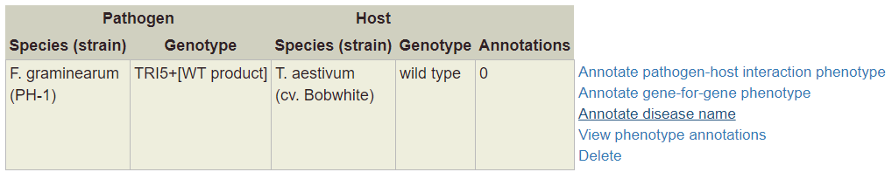
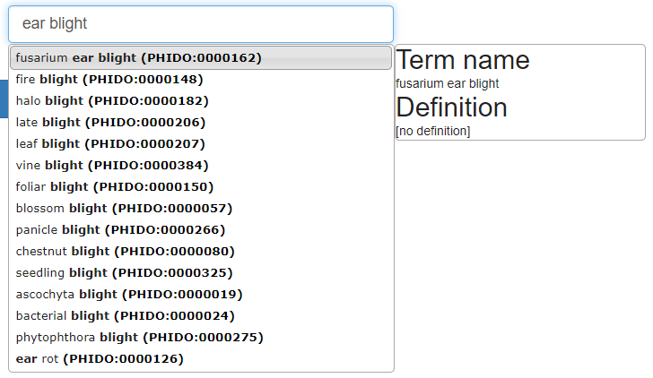
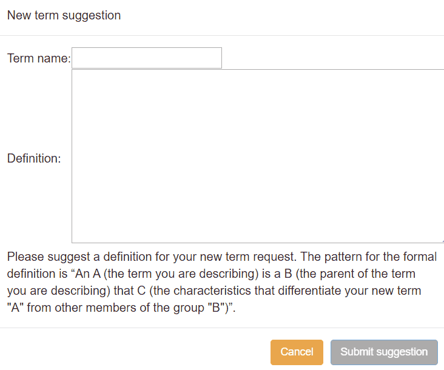
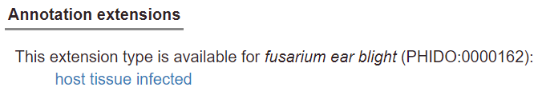
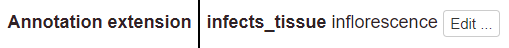
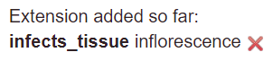
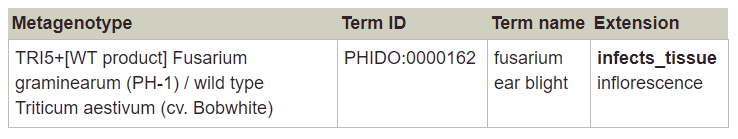
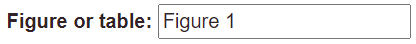
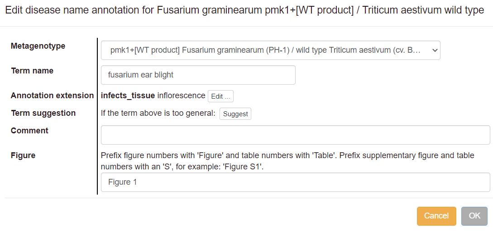
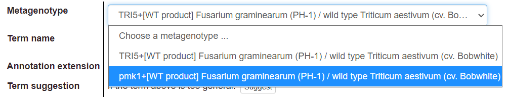

# Curating disease names

## Introduction

PHI-Canto allows curation of infectious diseases that result from pathogen–host interactions. An infectious disease is defined as ‘a disorder resulting from the presence and activity of a microbial, viral, fungal, or parasitic agent […] transmitted by direct or indirect contact.’ ([NCIT:C26726](http://purl.obolibrary.org/obo/NCIT_C26726)) PHI-Canto supports annotation of disease names on metagenotypes (a combination of pathogen and host genotype), using terms from the [PHIDO](https://github.com/PHI-base/phido) disease list.

Each metagenotype containing a wild type gene should be annotated with at least one disease annotation (assuming a disease name is known). Diseases should only be annotated on pathogen–host interactions where the disease is present: that is, with a susceptible host strain and a compatible pathogen strain. The host must also be a natural host for the pathogen (i.e. not a model host). The annotated tissue type should correspond to where the disease is normally expected to be observed: for example, _Fusarium ear blight_ would normally be observed on an _inflorescence_ ([BTO:0000628](http://purl.obolibrary.org/obo/BTO_0000628)).

When using PHIDO terms – or terms from any ontology – always pay careful attention to the term definitions. They are usually more detailed, and often more informative, than the term names alone. For each annotation, ensure that the definition of the selected term accurately describes the experiment you are trying to capture, and that the results shown in the paper fit all parts of the term definition.

## Starting a disease annotation

To annotate a disease on a pathogen-host interaction (a metagenotype), go to the Metagenotype Management page and select ‘Annotate disease name’ from the list of actions next to the relevant metagenotype.

Note that you must first have created a metagenotype; see [Creating alleles and genotypes](genotypes) for instructions.

## The disease curation process

### Selecting a term

Next, to find a PHIDO term, type text into the search box. When suggestions from the autocomplete feature appear, choose one and proceed.

If your initial search does not find any suitable terms, try again with a broader term (e.g. ‘blight’ or ‘bacterial’). Selecting a term takes you to a page where you can read the definition to confirm that it is applicable.

Annotations with PHIDO should be as specific as possible to describe the data from your experiment. You can request a new term if the most specific term available does not adequately describe your disease. Select the ‘Suggest a new child term’ link and fill in the form that is shown:

### Annotation extensions

You can add annotation extensions to provide additional specificity for PHIDO annotations (see below for specific examples). After you have selected an ontology term and evidence, the PHI-Canto interface will display a list of available extension types.

Select an extension type to show a pop-up where you can specify the required details for the extension:

You can add multiple extension types to one annotation, but be aware that this has the effect of saying that _all_ the extensions apply to the annotation at once (usually meaning all extensions were present together at some point in time).

If the extensions did _not_ occur together (for example, if different tissues were infected in two separate experiments, rather than both infected at once), then you should apply the extensions to separate annotations. You can use ‘Copy and edit’ on an annotation to speed up the process of adding individual extensions: finish the first annotation with one extension, copy-and-edit to create another annotation, then edit the extensions on the new annotation.

After adding an annotation extension, the extension name shown in annotation tables (and elsewhere) will be a more concise unique identifier.

When you edit or duplicate an annotation, you can also add more extensions, or remove existing extensions. Use the ‘Edit…’ button in the annotation editing pop-up to do this:

It is not possible to edit an existing extension; instead, you must delete the existing extension (by clicking the red cross next to the extension name), then add a new extension.

PHI-Canto supports the following extensions for disease annotations:

* **Host tissue infected:** relates a disease annotation to the tissue type (or anatomical region) where the disease occurred. Terms describing the tissue types are specified by the [BRENDA Tissue Ontology](https://brenda-enzymes.org/ontology.php?ontology_id=3).

### Finalizing the annotation

Once you have entered all the data for your annotation, you will see a confirmation page that shows a preview of your annotation before it is created. The annotation preview will look like this:

### Figure and table numbers

The confirmation page includes a text box for including the Figure or Table number related to the annotation. Please prefix figure numbers with ‘Figure’ and table numbers with ‘Table’. Prefix supplementary figure and table numbers with an ‘S’, for example: ‘Figure S1’.

### Annotation comments

The confirmation page also has a text box where you can add additional information as a comment on each annotation. We recommend that comments include any details that do not fit the available evidence codes.

The data in the comments section will not be shown on the PHI-base website; the comments are intended to facilitate the checking of a session by the approval team (PHI-base and carefully selected species experts) prior to approval of the curated session.

Once you select ‘OK’ on this screen, your annotation will be saved. You can then either make further annotations, pause the session and come back to it later, or submit the completed curation session for approval.

## Editing, deleting and duplicating disease annotations

**Edit:** If you want to make changes to an annotation you have made, use the ‘Edit’ link next to the annotation in the table. In the pop-up edit the appropriate fields, then select ‘OK’.

**Copy and edit:** this link allows you to copy an annotation to another metagenotype, or to create a new annotation with minor edits on the same metagenotype. For example, you may want to indicate that you have observed the same disease at the same tissue type in a different organism. The interface works the same way as editing an annotation, except that a new annotation is created, and the old annotation is retained without changes.

**Delete:** The ‘Delete’ link deletes the annotation.
