# Creating alleles and genotypes

## Pathogen or Host Genotype Management

The Genotype Management pages are used to create genotypes containing one or more alleles. To start creating genotypes, follow the ‘Pathogen genotype management’ link or the ‘Host genotype management’ link from the curation summary page, depending on whether you want to create genotypes for a pathogen or a host.

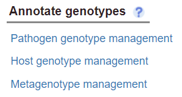

Once on the page, If you have more than one organism in the session, the first thing you will need to do is select the organism that you want to create a genotype for:

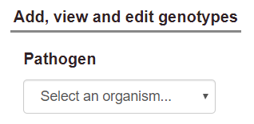

After selecting an organism, a table of its genes will appear below. 

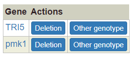

### Creating single-allele genotypes

For each gene, you can use the 'Deletion’ button as a shortcut to add a single-allele deletion genotype. For other allele types, you can use the ‘Other genotype…’ button to show a pop-up that allows you to create single-allele genotypes.

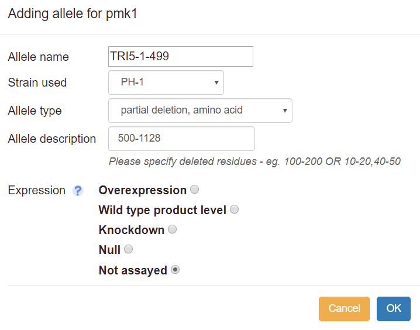

1. **Allele name:** this field is optional. Fill this in if the allele is named, e.g. TRI5-1-499. For the _wild type_ and _deletion_ allele types, a default name will be assigned. For other types, the allele will be denoted ‘unnamed’ if no name is provided. As you type the allele name, an autocomplete list will appear if there are matches to any alleles already in Canto's database. If your allele name appears, you can select it, and its type and description will be filled in; you will only have to choose the expression level.
2. **Allele type:** choose an allele type from the drop-down list. If the specific mutations are not known, choose ‘unknown’. If the alterations are complex (for instance, a mixture of insertions, point mutations, etc.), choose ‘other’ and describe the changes as free text.
3. **Allele description:** for some allele types, e.g. _partial deletion_ or _substitution_, further description is required. In these cases, an example description will be displayed in the box as grey text. You should number nucleotide positions starting with the ‘A’ of the initiator ATG for protein-coding genes. Mutations in promoter regions can also be specified by prefixing the numbers with a hyphen ‘-’ sign.
4. **Expression:** you will be prompted to define the expression level relative to wild-type (deletion mutants are automatically set to null). Note that ‘expression’ refers to the amount of gene product present in the assayed cells. If the product level was not measured (e.g. by Western blot for a protein), choose ‘Not assayed’, even if a construct such as an inducible promoter was used to try to alter expression.
5. **Descriptions for ‘unknown’ alleles:** if you know the description for any allele that is listed as ‘unknown’ in Canto, please enter it. To do so, type in the allele name, but do not select anything from the autocomplete list. Instead, proceed as if no match had been found, and you will be able to choose a type and enter a description.

As you add alleles, they will appear in a table on the right (any single alleles added via the Single Allele Phenotype option on the gene page will also appear here):

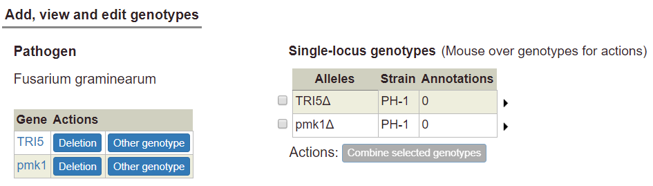

### Creating multi-locus genotypes

Genotypes containing multiple alleles are not created directly; rather, they are created by combining single-allele genotypes.

To create a multi-allele genotype, first add all of the constituent single alleles to the single-allele table. Then select two or more alleles by ticking the boxes at the left side of the table. Selecting two or more alleles will enable the ‘Combine selected genotypes’ button:

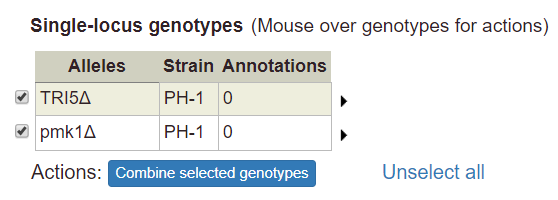

Click the button to combine the selected genotypes into a multi-allele genotype. The new multi-allele genotype will appear in a separate table below:

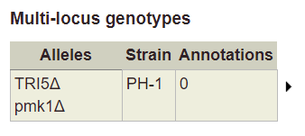

#### Using wild-type alleles in genotypes

A wild-type gene at its normal (endogenous) expression level will generally not have phenotypes annotated in PHI-Canto. Single wild-type alleles should only have phenotypes if the gene is expressed at a higher (overexpression) or lower (knockdown) level than normal. Similarly, in a multi-allele genotype, if the wild-type allele is the only allele of the gene present, it should only be included if it is over- or under-expressed.

Wild-type genes (as a single allele with wild-type expression) should only be used in a _control metagenotype_ that corresponds to a pathogen-host interaction (including gene-for-gene interactions): in these cases, a control genotype and phenotype need to be recorded in order to disambiguate naturally-occurring phenotypes (caused by strain sequence variation in the natural strain) from experimental phenotypes (caused by mutations introduced by the author).

### Editing and copying genotypes

When you mouse over any genotype in either table, a set of options appears in a popup:

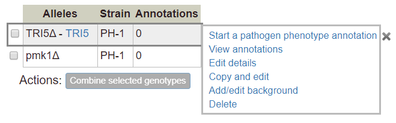

**Start a pathogen / host phenotype annotation:** begins the workflow to add a pathogen or host phenotype for the selected genotype (see ‘[Curating phenotypes](phipo_annotation#single_species_phenotypes)’ for more details).

**View annotations:** links to a page that shows details for the selected genotype, plus any phenotype annotations associated with the genotype. Links are available to edit the details of the selected genotype, or to quickly create an additional genotype using the copy and edit function (by following the ‘Duplicate’ link). Links are also available to edit existing annotations on the selected genotype (Edit); create new annotations based on existing ones (Copy and edit); or remove existing annotations (Delete). You can also create new phenotype annotations by following the link in the ‘Actions’ section.

**Edit details:** links to a page where you can edit the details of the selected genotype, such as its name, background mutations, strain, and comments. You can also add, edit, or remove alleles for the genotype.

**Copy and edit:** links to the genotype editing page as described above, but creates a new genotype with the amended details after the editing is complete (annotations are not copied to the new genotype).

**Add/edit background:** display a text box that can be used to specify background alleles. If any background alleles have been previously specified, they can be edited by changing the text. Background alleles can be removed by deleting all the text from the text box. Background alleles will appear in a column in the genotype table:

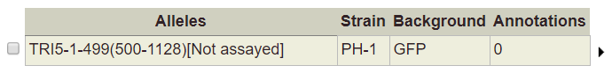

Note: If your genotype is from a strain that already includes the names of background alleles, you do not need to specify the names of background alleles in the Background field.

Note: If a single allele has a background, the background will be included with any multi-allele genotype that uses the allele. If two or more alleles have backgrounds, the backgrounds will be combined in the multi-allele genotype (alleles with duplicate backgrounds will only be included once). To change the background, use one of the ‘Add/edit background’, ‘Edit details’, or ‘Copy and edit’ options.

**Delete:** delete the selected genotype. The action is disabled for any genotype that has phenotype annotations. To delete a genotype with annotations, first delete the annotations (you can view the annotations with the ‘View annotations’ link, or by returning to the curation summary page).

## Metagenotype Management

The _metagenotype_ is an abstract concept that combines a pathogen genotype with a host genotype: it is the underlying genotype of a pathogen–host interaction. Metagenotypes are annotated with _pathogen–host interaction phenotypes_.

Metagenotypes are created by combining genotypes: a pathogen genotype and a host genotype are selected, then combined to form a new metagenotype. In Canto, you can create metagenotypes by following the Metagenotype Management link on the curation summary page or the Genotype Management page.

To curate a pathogen-host interaction (including gene-for-gene interactions), you should first create a _control metagenotype_, which contains the control genotypes for the pathogen and the host. The control genotypes will usually, but not always, contain wild-type alleles of the genes of interest. After the control metagenotype is created, you should create another metagenotype that describes mutant alleles within either the pathogen genotype, host genotype, or both genotypes simultaneously (the experimental metagenotype can be linked to the control metagenotype by way of an annotation extension, which is described in [Curating phenotypes](phipo_annotation#annotation_extensions)).

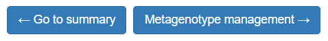

Since every metagenotype requires a pathogen and host genotype, you cannot access the Metagenotype Management page until you have created at least one pathogen genotype (the wild-type host genotypes are always available by default).

Once you enter the Metagenotype Management page, if you have more than one organism in your session, the first thing you need to do is select the pathogen and host organisms that will be part of the metagenotype:

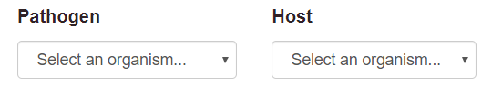

If you only have one pathogen or one host, they will be selected by default. After selecting an organism, a table of its genotypes will be shown (unless the organism has no genotypes).

### Creating metagenotypes

You can select a pathogen or host genotype by clicking the radio buttons next to the rows of the genotype tables.

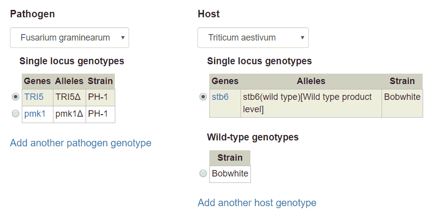

After picking one genotype from the pathogen side and one from the host side, you will be able to create a metagenotype by clicking the ‘Make metagenotype’ button:

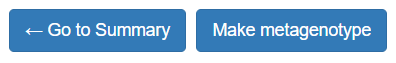

Host organisms may have no alleles (and therefore no genotypes). In this case, the Metagenotype Management page will show a list of the strains that have been added to the session for that organism. This list represents the wild-type genotypes for each particular strain. The wild-type host genotypes can be selected in the same way as mutant host genotypes (by clicking the radio button next to the row).

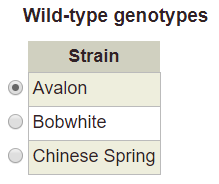

Selecting a host strain has the intent of describing an interaction between the wild-type host (of the specified strain) with some mutant pathogen. It is not necessary to select the strain for a mutant genotype, because this strain information is always embedded in the mutant genotype itself.

### Managing metagenotypes

Each row of the metagenotype table (shown at the bottom of the Metagenotype Management page) has links for common actions:

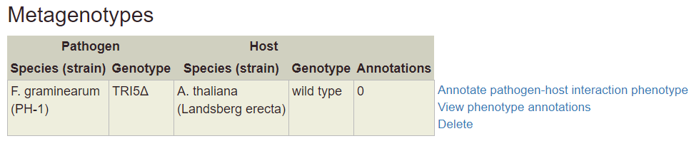

**Annotate pathogen-host interaction phenotype:** begin the workflow to create a pathogen-host interaction phenotype annotation (see ‘[Curating phenotypes](phipo_annotation#pathogen_host_interaction_phenotypes)’ for more details). After completing an annotation, you will be taken to the metagenotype details page.

**View phenotype annotations:** show a details page for the selected metagenotype, plus any phenotype annotations associated with the metagenotype. You can edit, copy and edit, or delete phenotype annotations on this page. New phenotype annotations can be created by following the link in the ‘Actions’ section.

(Please note that it is not possible to edit the selected metagenotype from the Metagenotype Details page. Edits can only be made to the pathogen or host parts of the metagenotype by using the Genotype Management pages.)

**Delete:** delete the selected metagenotype. The action is disabled for any metagenotype that has phenotype annotations. To delete a metagenotype with annotations, first delete the annotations (you can view the annotations with the ‘View phenotype annotations’ link, or by returning to the curation summary page).
