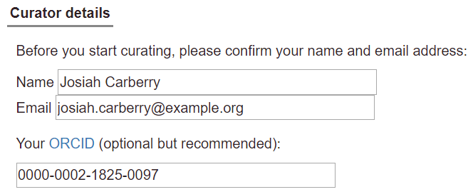

# Getting started

## Finding a publication

To start a curation session in Canto, enter the PubMed ID of your chosen publication in the search box on the left of the page. Note that the ‘PMID:’ prefix is optional.

## Starting a session

When you enter a curation session in Canto, you will see a message with a few basic details about the paper and how to proceed:

If you want to delegate curation to someone else (e.g. the first author or another current lab member), click "Reassign paper", and fill in the name and email address of the intended recipient on the next page.

Otherwise, click "Start curating", confirm your name, email address, and (optionally) your [ORCID](http://orcid.org/) on the next page, then continue. After starting the session, you will receive an email reminding you of the curation session link and basic instructions.

Note: you can also begin curation and then reassign a session later; there is a "Reassign" button near the upper right corner of the page:

Once you have begun a session, your session will be preserved at a stable URL, so you do not need to complete the curation in one go. Most pages have at least one '?' icon, which links to help documentation (mouse over to see a brief description). You can use the ‘Contact curators' link at any point if you get stuck, or have any questions.

## Adding genes and organisms

To start curating a paper, you will first be asked to supply a UniProtKB accession number for each gene from your publication:

In the case where your publication contains host organisms with no genes specified, you can pick these hosts using the organism picker below the gene entry field (you can search for hosts by scientific name, common name, or NCBI Taxonomy ID):

### Finding genes in UniProtKB

PHI-Canto uses [UniProt Knowledgebase](https://www.uniprot.org/help/uniprotkb) (UniProtKB) gene accession numbers to disambiguate genes/proteins. This is to ensure that we are talking about the correct gene product – especially because the same names are sometimes used for different proteins – and to standardize entries, because not all strains of an organism are in UniProt.

1. **Identify the reference proteome** (we use the designated reference proteome to integrate different strain information at the gene level in PHI-base). In PHI-Canto you will be able to specify the strain you used.

    Look up the reference proteome for your organism using the species name ([https://www.uniprot.org/help/reference_proteome](https://www.uniprot.org/help/reference_proteome)).

    If there is no reference proteome, use the strain studied.

2. **Identify the gene of interest in the reference proteome**

    Start from the [UniProt homepage](https://www.uniprot.org/), then perform any of the following steps:

    * Search for the author assigned gene name/primary name (e.g. Tri5) or synonyms, plus species name (e.g _Fusarium graminearum_).
    * If the gene does not have a ‘given name’ but a locus ID is provided, search using the locus_id (e.g. FGRRES_03537) plus species name (e.g. _Fusarium graminearum_). If the entry identifier used is not the reference strain, copy the protein sequence and go to the BLAST step below.
    * Search on a protein description (e.g. Trichodiene synthase)
    * Obtain the protein sequence for your gene of interest and BLAST against UniprotKB ([https://www.uniprot.org/blast/](https://www.uniprot.org/blast/)) with your protein sequence. \
**Note:** If there are multiple entries for your gene product from the reference strain, please select the ‘Reviewed entry’. Use the left hand filter for ‘Reviewed entries’.
    * If the gene cannot be located in UniProt, contact the authors, UniProt, or PHI-base for help locating the canonical database entry.
3. **Add the entry into PHI-Canto.** Once the entry of interest is located, select the entry accession number (also called ‘Entry’) from column 1 of the results table, and use this to retrieve the entry into PHI-Canto on the gene entry page. Be careful not to confuse the ‘Entry' column with the ‘Entry name' column. PHI-Canto uses the accession number to retrieve details (such as the gene name, gene product, and organism). If PHI-Canto is unable to find your entry, check for typos (e.g. 0 for O), ensure you are using the ‘entry’ not ‘entry name’, and check that your accession is from UniProtKB, not UniParc.

### Information not valid for curation

If the paper does not mention individual genes – which is typical of methods papers, many types of high-throughput study, reviews – check the box labeled ‘This paper does not contain any gene-specific information’, and select a reason from the pulldown that appears.

Complete the session by clicking ‘Continue’ and then ‘Finish’. Further comment is optional.

If the paper mentions specific genes, but does not contain any data that can be curated in Canto for them (see Curating specific data types), enter the genes and finish the session as described below (see Finishing and submitting).

Please note that you should only curate information supported by experiments in the paper you are curating. If you want to capture other information not directly shown in a particular paper, please contact the curators (contact@phi-base.org) to discuss how to proceed.

## Adding strains

Once you have specified your genes and any host organisms (with no specified genes), the next screen will allow you to confirm the genes and organisms that have been retrieved from UniProt.

The next step is to add one or more ‘experimental strains’ for every organism in your curation session. Note that for the purposes of PHI-Canto, the term _strain_ is used broadly to refer to any taxonomic classifier more specific than a species. This includes (but is not limited to): subspecies, varieties, pathovars, cultivars, and strains in the conventional sense.

You can add experimental strains using the strain picker that is located below each pathogen and host on the page:

You can select a strain from the list by using your mouse or the arrow keys on the keyboard (use Enter or Tab to confirm a strain with the keyboard). Typing a strain name into the text input will filter to the list of strains to match what you typed:

If you want to add a strain that is not in the list, type its name into the text input, then click the ‘Add strain’ button, or hit Enter on your keyboard. Custom strains will be highlighted in orange once added:

Use the ‘Unknown strain’ button if the publication does not specify a strain for the organism (or does not describe the organism more specifically than its species).

To delete a strain, click the cross symbol next to the strain name. Note that you will be unable to delete a strain if it is used by other genotypes in the curation session.

Note: if your new strain contains background mutations, please do not specify these in the strain name unless it is conventional for the strain name to include the names of other mutations. Otherwise, you should specify background mutations using the ‘Background’ information on a genotype (see [Creating alleles and genotypes](genotypes)).

Once you have specified strains for each organism, you can continue to the curation summary page; from there, you can annotate genes and genotypes with the annotation types described in this article.

## Curating specific data types

Annotations in PHI-Canto are divided into three types: gene annotations, genotype annotations, and metagenotype annotations. Follow the links below for specific instructions.

### Gene annotations

* **[GO molecular function](go_annotation)**: A molecular function is a catalytic (e.g. protein serine/threonine kinase activity, pyruvate carboxylase activity) or binding activity, or any other activity that occurs at the molecular level.
* **[GO biological process](go_annotation)**: A biological process is a series of events accomplished by one or more ordered assemblies of molecular functions, such as cell cycle regulation, ion transport, or signal transduction.
* **[GO cellular component](go_annotation)**: Cellular components include subcellular structures and macromolecular complexes, such as nucleus, nuclear inner membrane, nuclear pore, and proteasome complex.
* **[protein modification](modification_annotation)**: A protein modification is a covalent modification or other change that alters the measured molecular mass of a peptide or protein amino acid residue.
* **[physical interaction](physical_interaction_annotation)**: Examples: co-purification, two-hybrid, affinity capture.

### Genotype annotations

See the [Creating alleles and genotypes](genotypes) documentation for instructions on creating genotypes.

* **[pathogen phenotype](phipo_annotation)**: Annotate normal or abnormal phenotypes of pathogen organisms with this genotype.
* **[host phenotype](phipo_annotation)**: Annotate normal or abnormal phenotypes of host organisms with this genotype.

### Metagenotype annotations

See the [Creating alleles and genotypes](genotypes) documentation for instructions on creating metagenotypes.

* **[pathogen-host interaction phenotype](phipo_annotation)**: Annotate normal or abnormal phenotypes of organisms within this pathogen-host interaction (metagenotype).

## Finishing and submitting

When you have finished entering data from your paper, click the ‘Submit to curators' button on the right-hand side of the Curation Summary page:

To submit a curation session that does not contain any annotations based on experimental data, check the ‘No experimental results to add?’ checkbox, then select a reason from the pulldown menu that appears:

After you have clicked ‘Submit to curators’, you will see a text box in which you can put any comments or questions for the curators (this is optional):

After you click ‘Finish’, you will not be able to make any further changes to your session. However, you can view the annotations in the session at any time. If you need to make any further changes to your curation session after submission, please contact the PHI-Canto curation team.
