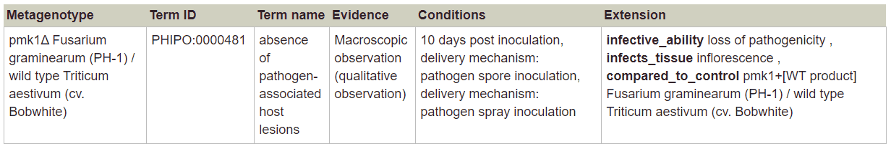
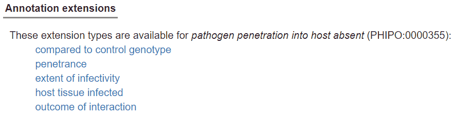

# Curating phenotypes

## Introduction

A phenotype is any observable characteristic or trait of an organism that results from the interactions between its genotype and the environment. PHI-Canto supports annotation of single- and multi-allele phenotypes on pathogen genotypes, host genotypes and metagenotypes (pathogen and host genotype), using PHIPO terms and additional useful details such as evidence and experimental conditions.

When using PHIPO terms – or terms from any ontology – always pay careful attention to the term definitions. They are usually more detailed, and often more informative, than the term names alone. For each annotation, ensure that the definition of the selected term accurately describes the experiment you are trying to capture, and that the results shown in the paper fit all parts of the term definition.

## Starting a phenotype annotation

### Single-species phenotypes

#### Genotype Management workflow

Using the Pathogen Genotype Management or Host Genotype Management pages, you can make phenotype annotations to a genotype of a single species. These genotypes can be either single-allele or multi-allele:

* A single allele is a mutation, or set of mutations, in one copy of a gene at one locus (which may be the endogenous locus or a different locus, such as a plasmid or an insertion at a non-native position). You can also annotate under- or over-expression of the wild type allele as a single ‘mutation’.
* You can also annotate phenotypes on a double mutant, triple mutant, or any strain in which more than one gene has its sequence or expression altered, including any case where you have more than one allele of the same gene present (e.g. one on the chromosome, and another on a plasmid). To do so, you must enter details of all relevant alleles in the genotype (background details such as mating type and markers are optional).

You can begin a phenotype annotation after creating a genotype (following the instructions in [Creating alleles and genotypes](genotypes)). After the genotype is created, you should see a menu appear with a list of actions. Select ‘Start a pathogen/host phenotype annotation’, then continue by following the steps in ‘The phenotype curation process’ section (see below).

#### Single allele workflow

If you only need to annotate the phenotype of a single allele, you can select a gene from the list of genes on the curation summary page, then select ‘Single allele phenotype’ from the list of curation types:

After selecting the option, a pop-up will appear where you can enter allele details:

After selecting ‘OK’, you will begin the phenotype curation process for the allele you have created (see ‘The phenotype curation process’ below).

### Pathogen-host interaction phenotypes

To annotate a phenotype on a pathogen-host interaction (a metagenotype), go to the Metagenotype Management page and select either ‘Annotate pathogen-host interaction phenotype’ or ‘Annotate gene-for-gene phenotype’ from the list of actions next to the relevant metagenotype.

Note that you must first have created a metagenotype; see [Creating alleles and genotypes](genotypes) for instructions.

## The phenotype curation process

### Selecting a PHIPO term

Next, to find a PHIPO term, type text into the search box. When suggestions from the autocomplete feature appear, choose one and proceed.

If your initial search does not find any suitable terms, try again with a broader term (e.g. ‘reproductive phenotype’). Selecting a term takes you to a page where you can read the definition to confirm that it is applicable. More specific ‘child’ terms will be shown (where available), and you can select one of these more specific terms in an iterative process.

PHIPO terms are organised in a hierarchical structure, and PHIPO annotations should be as specific as possible to describe the data from your experiment. You can will have the opportunity to request a new term if the most specific term available does not describe your gene product adequately: select the ‘Suggest a new child term’ link and fill in the form that is shown:.

### Experimental evidence

After you choose a term, you will be prompted to select an experimental evidence code from a pulldown menu:

### Experimental conditions

After selecting experimental evidence, you can optionally enter any experimental conditions. It is not necessary to record all of the experimental conditions, just those that are key to the experiment.

Conditions are aspects of the experimental setup that may be relevant to various different methods, and are independent of what cells, strain, organism, etc. are used. Examples include:

* Minimal medium vs. rich medium
* Agar plates vs. liquid medium
* Addition of certain chemicals; for instance, in a salt stress experiment it may be of interest to note what salts were added. (Note that in cases where the PHIPO term already describes sensitivity or resistance to a certain chemical, it is not necessary to specify that same chemical in the experimental conditions.)
* Temperature (high, standard or low).
* Exclusion of some chemicals that one might normally expect to be present.

To add conditions, type text and select from the autocomplete options. Several conditions can be added for one experiment.

Condition terms previously used in the session appear below the text box and can be reused by selecting them:

It is also possible to add experimental conditions that do not appear in the autocomplete list. To do this, type your experimental condition, then either click inside the text box, or hit Enter or Tab on your keyboard. The condition should change to a tag:

PHI-Canto will display custom experimental conditions in red text, pending their review by an expert curator before they are added to the main list of experimental conditions.

### Annotation comments

Once you have entered all the data for your annotation, you will see a confirmation page that shows a preview of your annotation before it is created. For single-species phenotypes, the annotation preview will look like this:

For pathogen-host interaction phenotypes and gene-for-gene phenotypes, the preview will look like this:

The confirmation page also has a text box where you can add additional information as a comment on each annotation. We recommend that comments include the following information (where applicable):

* figure or table numbers;
* whether an annotation has been made to a control genotype or control experiment;
* any details that do not fit the available evidence codes

The data in the comments section will not be shown on the PHI-base website; the comments are intended to facilitate the checking of a session by the approval team (PHI-base and carefully selected species experts) prior to approval of the curated session.

Once you select ‘OK’ on this screen, your annotation will be saved. You can then either make further annotations, pause the session and come back to it later, or submit the completed curation session for approval.

## Annotation extensions

You can add annotation extensions to provide additional specificity for PHIPO annotations (see below for specific examples). After you have selected an ontology term and evidence, the PHI-Canto interface will display a list of available extension types (if no extension types are available, this step is skipped, and you will go straight to the annotation summary page).

Select an extension type to show a pop-up where you can specify the required details for the extension. For example, an annotation to ‘abolished pathogen penetration into host’ can have any of these extensions:

You can add multiple extension types to one annotation, but be aware that this has the effect of saying that _all_ the extensions apply to the annotation at once (usually meaning all extensions were present together at some point in time).

If the extensions did _not_ occur together (for example, if different tissues were infected in two separate experiments, rather than both infected at once), then you should apply the extensions to separate annotations. You can use ‘Copy and edit’ on an annotation to speed up the process of adding individual extensions: finish the first annotation with one extension, copy-and-edit to create another annotation, then edit the extensions on the new annotation.

In all cases, the actual relation name used by the database will appear when you have finished the annotation plus extensions.

When you edit or duplicate an annotation, you can also add more extensions, or remove existing extensions. Use the ‘Edit…’ button in the annotation editing pop-up to do this:

It is not possible to edit an existing extension; instead, you must delete the existing extension (by clicking the red cross next to the extension name), then add a new extension.

PHI-Canto supports the following annotation extensions:

#### Pathogen or Host phenotype extensions

* **Penetrance:** the proportion of a population that shows the phenotype. The penetrance measurement can be qualitative or quantitative. The pulldown menu for qualitative options is selected by default. For a quantitative value, switch the radio button and enter a percentage (e.g. 38%) in the text box.
* **Severity:** Only qualitative values are supported; choose from the pulldown menu. (Note: severity was previously called ‘expressivity’, and can still be used in the sense of the extent to which a phenotype is expressed.)
* **Assayed feature:** A specific gene, RNA or protein, used in an assay. The pulldown menu is populated with genes from the list you entered for the paper. You can add another gene at this point if necessary.

#### Pathogen-host interaction phenotype extensions

* **Host tissue infected:** relates a pathogen-host interaction to the tissue type (or anatomical region) where the interaction occurred. Terms describing the tissue types are specified by the [Brenda Tissue Ontology](https://brenda-enzymes.org/ontology.php?ontology_id=3).
* **Infective ability:** relates a pathogen-host interaction phenotype with one of the set of high-level phenotype terms from PHI-base, and describes the overall change in factors like pathogenicity and virulence. For example, the phenotype ‘abolished pathogen penetration into host’ can be extended with ‘loss of pathogenicity’, such that the phenotype was an effect of a change in the infective ability of the pathogen.
* **Compared to control genotype:** records a pathogen genotype and a host genotype (combined as a metagenotype) that are used as an experimental control for the genotypes in the interaction. Usually the control genotypes will be the wild-type genotypes of the pathogen and host, but they may also be mutant genotypes.
* **Outcome of interaction:** describes the overall outcome of the interaction in terms of whether disease was present or absent in the host.

#### Gene-for-gene phenotype extensions

* **Host tissue infected:** relates a pathogen-host interaction to the tissue type (or anatomical region) where the interaction occurred. Terms describing the tissue types are specified by the [Brenda Tissue Ontology](https://brenda-enzymes.org/ontology.php?ontology_id=3).
* **Compared to control genotype:** records a pathogen genotype and a host genotype (combined as a metagenotype) that are used as an experimental control for the genotypes in the interaction. Usually the control genotypes will be the wild-type genotypes of the pathogen and host, but they may also be mutant genotypes.
* **Gene-for-gene interaction:** describes multiple properties of a gene-for-gene interaction, including: whether a gene conferring disease resistance in the host was present, absent, or compromised; the presence or absence of a pathogen effector molecule that can be recognized by the host; and whether the interaction caused disease in the host (a compatible interaction) or did not (an incompatible interaction).

## Editing, deleting and duplicating phenotypes

**Edit:** If you want to make changes to an annotation you have made, use the ‘Edit’ link next to the annotation in the table. In the pop-up edit the appropriate fields, then select ‘OK’.

**Transfer:** this link allows you to copy the phenotype annotation to one or more genotypes or metagenotypes in the session. Single species phenotypes can be transferred to other genotypes, and pathogen-host interaction phenotypes can be transferred to other metagenotypes. You can choose to include or exclude the annotation extensions of the original annotation on the new annotations.

**Copy and edit:** this link allows you to make a new annotation to the same allele or genotype. For example, you may want to indicate that you have observed a phenotype under more than one set of conditions, e.g. at both standard and high temperatures. The interface works the same way as for editing an annotation, except that a new annotation is created, and the old annotation is retained without changes.

On the curation summary page, you can use ‘Copy and edit’ to copy an annotation to any other genotype in the genotype list, by selecting another genotype in the ‘Genotype’ field. This differs from the ‘Transfer’ action in that you can edit the annotation before copying it.

**Delete:** The ‘Delete’ link deletes the annotation.
