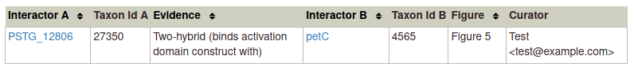

Curating Physical Interactions
==============================

If you have physical interactions to curate, please read the Directionality section carefully.

We recommend that you only annotate interactions that you think are biologically meaningful. For example, do not include known or suspected contaminants from mass spectrometry results (e.g. ribosomal proteins, translation factors, 'sticky' proteins).

When you choose 'Physical interaction', a popup appears with a dropdown menu for the organism(s) involved in the interaction. To curate an intraspecies (or intra-organism) interaction, you can select the same organism in both fields. After selecting the first organism, the rest of the form fields will appear, including a text field for optional comments.

Choose the gene for the first organism in the 'Gene' field and the gene for the interacting organism in the 'Interacting gene' field. Choose an evidence type from the 'Interaction type' dropdown menu. Some evidence types have a brief description that indicates their directionality. Further information on evidence supporting physical interactions, including examples of experiment types in each category, is available on the BioGRID help wiki and in the Directionality section below.

Click 'OK' to finish the annotation and close the popup. An example of a completed physical interaction annotation is shown below.

Note that only pairwise genetic interactions can be annotated in PHI-Canto.

Directionality
--------------

Some experiments that detect physical interactions have an inherent directionality. For example, in a typical two-hybrid experiment one protein (A) is fused to a DNA binding domain and a second (B) is fused to a transcription activation domain. The reciprocal experiment, with A fused to the activation domain and B fused to the DNA binding domain, may or may not have been done.

For such asymmetric interactions, PHI-Canto allows you to curate in only one direction starting from the gene you select first, as indicated in the interaction type selector.

If the evidence description looks the wrong way around, you will have to change genes and start again (you can finish and then delete an interaction annotation if you find that you have started with the wrong gene).

| Evidence                                      | Relationship (A → B)                   |
| --------------------------------------------- | -------------------------------------- |
| Affinity Capture-Luminescence                 | affinity captures                      |
| Affinity Capture-MS                           | affinity captures                      |
| Affinity Capture-RNA                          | affinity captures                      |
| Affinity Capture-Western                      | affinity captures                      |
| Far Western                                   | captures                               |
| FRET (fluorescence resonance energy transfer) | fluorescence resonance energy donor to |
| Protein-peptide                               | binds to peptide                       |
| Protein-RNA                                   | binds to RNA                           |
| Two-hybrid                                    | binds activation domain construct with |

Use one of the Affinity Capture evidence types for co-immunoprecipitation. If you have done the experiment in both directions, you should curate two annotations to describe the interaction completely. Curate starting from one gene, then switch genes to annotate the reciprocal experiment. Other experiment types are symmetric and therefore only need to be entered once, and you can start from either of the interacting genes.

| Evidence                                      | Relationship (A → B) |
| --------------------------------------------- | -------------------- |
| Co-crystal Structure                          | co-crystallizes with |
| Co-fractionation                              | co-fractionates with |
| Co-purification                               | co-purifies with     |
| Reconstituted Complex                         | forms complex with   |
| PCA* (protein-fragment complementation assay) | interacts with       |

\* Note that PCA is not exactly symmetric, since there will be one N-terminal and one C-terminal reporter fusion construct, but it is treated as symmetric in PHI-Canto.
